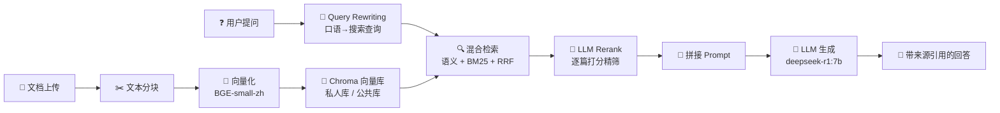

# RAG 智能问答系统

基于 RAG (Retrieval-Augmented Generation) 架构的本地知识库问答系统。上传文档 → 自动分块向量化 → 提问 → AI 根据文档内容回答并标注来源。

**完全本地运行**：使用 Ollama 部署的 `deepseek-r1:7b` + `BAAI/bge-small-zh-v1.5`，无需联网，数据不出本机。

## 架构总览



## 快速开始

### 1. 环境要求

- Python 3.10+
- [Ollama](https://ollama.com) 已安装并启动
- 至少 8GB 空闲内存（嵌入模型约 400MB + LLM 约 4.7GB）

### 2. 安装依赖

```bash
cd rag-qa-system
pip install -r requirements.txt
```

### 3. 拉取模型

```bash
ollama pull deepseek-r1:7b            # 文本生成 (~4.7GB)
ollama pull nomic-embed-text           # 可选，当前用 BGE 本地嵌入
ollama pull llama3.2-vision:11b        # 可选，图片/表格识别 (~7.8GB)
```

### 4. 启动

```bash
streamlit run app.py
```

浏览器打开 `http://localhost:8501`，上传文档，开始提问。

## 技术栈

| 组件 | 选型 | 选型理由 |
|------|------|----------|
| **大模型** | deepseek-r1:7b (Ollama) | 本地部署零成本、中文强、推理链透明 |
| **嵌入模型** | BAAI/bge-small-zh-v1.5 | 中文优化、512维/速度快、离线可用 |
| **向量库** | Chroma | 轻量零配置、本地持久化、支持多 Collection |
| **关键词检索** | BM25 (rank_bm25 + jieba) | 无外部依赖、中文分词精准、与语义检索互补 |
| **融合算法** | RRF (Reciprocal Rank Fusion) | 无需归一化异构分数、k=60 平滑常数 |
| **UI 框架** | Streamlit | 聊天界面原生支持、Python 纯写、快速迭代 |
| **元数据存储** | SQLite | 零配置、SQL 标准、与 Chroma 互为备份 |
| **PDF 解析** | PyMuPDF (fitz) | 图文表格全支持、Python 最成熟的 PDF 库 |
| **分词** | jieba | 中文分词标准方案、轻量零配置 |

## 项目结构

```
rag-qa-system/
├── app.py                      # Streamlit 主界面（多用户版）
├── config.py                   # 全局配置常量
├── requirements.txt            # Python 依赖
├── README.md                   # 本文件
├── interview_prep.md           # 面试高频问题+回答要点
├── mcp_config.json.example     # MCP 客户端配置示例
├── src/
│   ├── __init__.py
│   ├── document_loader.py      # 多格式文档解析 (PDF/Word/TXT/MD)
│   ├── text_splitter.py        # RecursiveCharacterTextSplitter 封装
│   ├── embeddings.py           # BGE 模型加载（单例模式）
│   ├── vector_store.py         # Chroma 增删查（多 Collection 支持）
│   ├── hybrid_retriever.py     # 语义 + BM25 + RRF 融合检索
│   ├── llm_client.py           # Ollama API 封装（文本+视觉）
│   ├── qa_chain.py             # RAG 问答完整流水线
│   ├── query_rewriter.py       # LLM 查询改写（口语→搜索查询）
│   ├── llm_reranker.py         # Pointwise LLM 重排序
│   ├── image_handler.py        # PDF 图片/表格提取 + 视觉描述
│   ├── multi_user.py           # 多用户命名空间管理
│   ├── mcp_server.py            # MCP Server（AI Agent 原生协议）
│   ├── api_server.py            # REST API Server（通用 HTTP）
│   └── knowledge_db.py         # SQLite 文档元数据 CRUD
├── data/
│   ├── uploads/                # 上传的原始文档
│   ├── chroma_db/              # Chroma 持久化目录
│   ├── extracted_images/       # PDF 中提取的图片
│   └── knowledge.db            # SQLite 数据库
└── requirements.txt
```

## 核心设计决策

### 1. 混合检索：语义 + BM25

**为什么不用纯语义检索？** 语义检索擅长找"意思相近"的内容（"退款"匹配"退费流程"），但对精确关键词（"Q3财报"、"v2.1版本"）可能漏掉。BM25 恰好互补。

**RRF 融合**：语义相似度分数和 BM25 分数不是一个量纲，直接加权需要归一化。RRF 只关心排名，公式简单有效：

$$RRF\ score = \sum_{i} \frac{1}{k + rank_i},\quad k=60$$

### 2. 查询改写 (Query Rewriting)

用户提问通常是口语化的（"这玩意儿怎么配置？"），直接用去检索效果很差。先让 LLM 把问题改写为更精确的搜索查询（"系统配置方法 设置步骤 参数说明"），再用改写后的查询去检索。**注意：生成答案时仍使用原始问题**，保证回答的针对性。

### 3. LLM Rerank（Pointwise）

检索（粗排）→ LLM 逐篇打分（精排）→ 取 top_k。经典的"粗排 + 精排"两阶段检索模式。

**为什么用 Pointwise 而不是 Listwise？** Pointwise 每篇独立打分，可以并行；Listwise 所有文档一起打分，受上下文窗口限制且更慢。打分标准 1-5 分，temperature=0.1 保证评分稳定性。

### 4. 多用户知识库隔离

每个用户独立 Chroma Collection（`kb_user_{username}`）+ 共享公共库（`kb_shared`）。搜索时同时查私人+公共，结果合并排序。类比 Python venv："环境隔离但共享底层引擎"。不搞密码认证——本地单机场景不需要，上生产再加 JWT 即可。

### 5. 完整流水线

```
用户问题 
  → Query Rewriting（口语→搜索查询）
  → 混合检索：语义(私人库+公共库) + BM25 
  → RRF 融合
  → 余弦距离阈值过滤
  → LLM Rerank（逐篇打分，取 top_k）
  → 拼接 Prompt（用原始问题）
  → LLM 流式生成
  → 返回答案 + 引用来源（标注🔒私人/🌐公共）
```

### 6. 幻觉控制

- **严格 Prompt 约束**："只使用参考资料中的信息，不要编造"
- **相似度阈值过滤**：cosine 距离 > 0.5 的文档直接丢弃
- **明确拒答**：无相关文档时返回"未找到相关信息"
- **来源引用**：每个回答必须标注引用了哪些文档片段

## 功能特性

- [x] 多格式文档（PDF/Word/TXT/Markdown）
- [x] 混合检索（语义 + BM25 + RRF）
- [x] 查询改写（口语→搜索查询）
- [x] LLM 重排序（Pointwise 打分）
- [x] 多用户知识库隔离（私人/公共）
- [x] 图片/表格识别（NotebookLM 风格）
- [x] 流式输出（逐 token 渲染）
- [x] 来源引用（标注文档名 + 片段预览）
- [x] 引用来源标注知识库来源（私人🔒/公共🌐）
- [x] 参数可调（Chunk Size / Top-K / Temperature）
- [x] 完全本地运行（无需联网）
- [x] MCP Server 集成（可被 Claude Code/Cursor 等 Agent 调用）
- [x] REST API 集成（任意语言、任意大模型 HTTP 调用）

## 🔌 集成方式 — 让任何大模型应用拥有 RAG 能力

本系统最大的差异化：**不仅是一个带 UI 的问答应用，更是可被任何大模型应用调用的知识库基础设施。**

提供两种集成方式：

### 方式一：REST API（推荐，最通用）

**一行 curl 就能用，任何语言、任何模型都能集成。**

```bash
# 启动 API 服务
python src/api_server.py
# 访问 http://localhost:8000/docs 查看 Swagger 文档

# 任意大模型应用中调用
curl -X POST http://localhost:8000/ask \
  -H "Content-Type: application/json" \
  -d '{"question":"什么是RAG?","username":"default"}'
```

| 端点 | 方法 | 功能 |
|------|------|------|
| `/health` | GET | 健康检查 + 系统信息 |
| `/search` | POST | 语义搜索，返回文档片段 |
| `/ask` | POST | 完整 RAG 问答，返回答案+来源 |
| `/docs/{username}` | GET | 列出知识库所有文档 |
| `/context` | POST | 获取完整文档上下文 |

**Python 接入示例（3 行代码）**：

```python
import requests
resp = requests.post("http://localhost:8000/ask",
    json={"question": "怎么部署微服务?", "username": "alice"})
print(resp.json()["answer"])  # 基于 alice 知识库的 AI 回答
```

**LangChain Tool 封装**：

```python
from langchain.tools import tool
import requests

@tool
def query_knowledge_base(question: str) -> str:
    """搜索私有知识库获取答案"""
    r = requests.post("http://localhost:8000/ask",
        json={"question": question})
    return r.json()["answer"]
```

### 方式二：MCP Server（AI Agent 原生协议）

支持 [MCP 协议](https://modelcontextprotocol.io) 的客户端（Claude Code、Cursor、Continue.dev）可直接调用。

```json
{
  "mcpServers": {
    "rag-kb": {
      "command": "python",
      "args": ["src/mcp_server.py"],
      "cwd": "/path/to/rag-qa-system"
    }
  }
}
```

### 架构价值（面试要点）

> 大多数 RAG 项目的终点是一个 Streamlit/Gradio UI；我的项目把 RAG 变成了**可被集成的协议服务**。其他开发者不需要看懂我的代码，只需要一行 curl 或 3 行 Python 就能让他们的 LLM 应用拥有私有知识库检索能力。这是从"应用"到"基础设施"的思维跃迁。

## License

MIT
